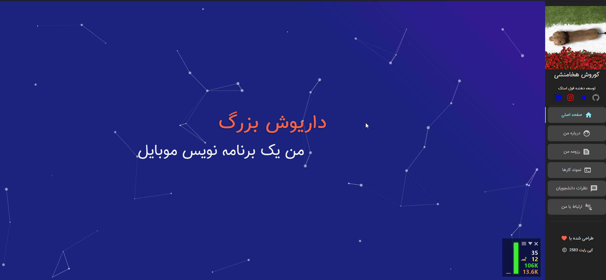
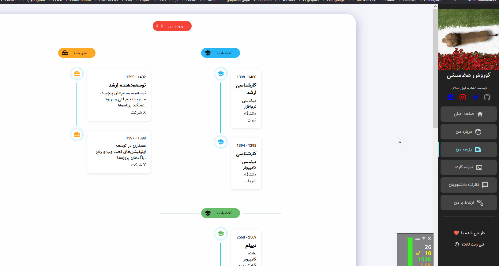

# پروژه اسکنر

این پروژه یک برنامه اسکنر با قابلیت‌های پیشرفته را پیاده‌سازی می‌کند.

## نمای کلی

یک راه حل جامع اسکن که قابلیت‌های دیجیتال‌سازی و پردازش اسناد با کیفیت بالا را ارائه می‌دهد.

## ویژگی‌ها

- اسکن با وضوح بالا
- پشتیبانی از فرمت‌های مختلف (PDF، JPG، PNG)
- تشخیص نوری کاراکتر (OCR)
- پردازش دسته‌ای
- تنظیمات سفارشی اسکن
- طراحی متریال دیزاین
- افکت‌ها و انیمیشن‌های متریال
- رابط کاربری مدرن و واکنش‌گرا

## تصاویر

### رابط اصلی

### فرآیند اسکن

### نمایش نتایج

## نصب

1. مخزن را کلون کنید
2. وابستگی‌های مورد نیاز را نصب کنید
3. برنامه را اجرا کنید

## نحوه استفاده

1. تنظیمات اسکن را انتخاب کنید
2. سند را در اسکنر قرار دهید
3. دکمه اسکن را کلیک کنید
4. نتایج را ذخیره یا پردازش کنید

## تکنولوژی‌های استفاده شده

- Java
- JavaFX
- Apache PDFBox
- Tesseract OCR
- Material Design Components
- Material Effects & Animations

## مجوز

این پروژه تحت مجوز MIT منتشر شده است - برای جزئیات بیشتر فایل LICENSE را مشاهده کنید.
